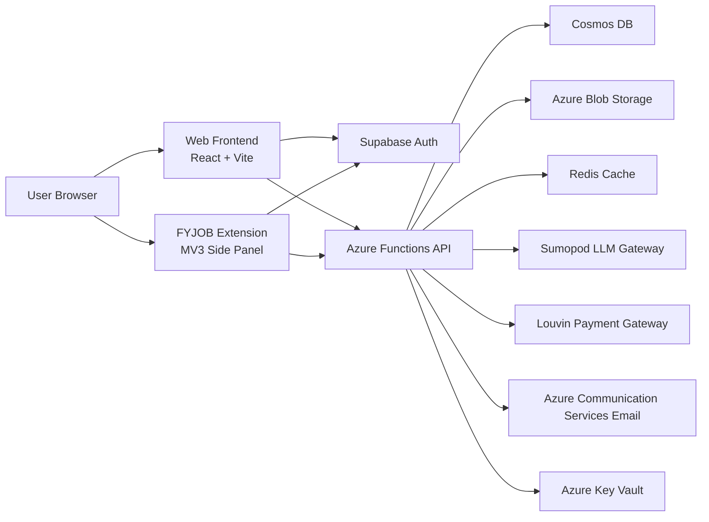
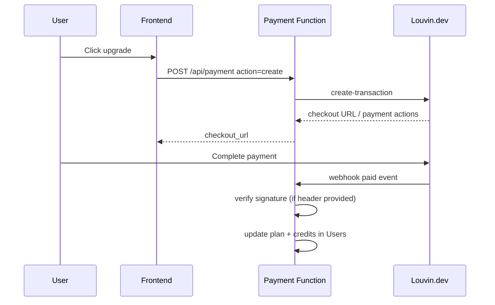

# FYJOB Monorepo

FYJOB is an AI-powered career readiness platform that helps job seekers prepare before applying to jobs.

This repository contains:
- Web application (frontend dashboard)
- Azure Functions backend (API + AI orchestration)
- Browser extension (job-page side panel scanner)

The project is organized for production usage with authentication, plan access, credit controls, payment flow, email notifications, and admin operations.

## 1. Product Overview

FYJOB core capabilities:
- Job matching analysis between user CV and job posting
- AI interview simulation (text and speech modes)
- Killer Quiz generation and submission scoring
- Personalized learning path generation
- CV management with Blob storage preview
- Browser extension for in-context job analysis
- Admin center for moderation and account operations

Primary user outcomes:
- Faster skill-gap identification
- Higher interview readiness
- Better alignment between profile and role requirements

## 2. Repository Structure

```text
.
├── azure-backend/              # Azure Functions (Python)
│   ├── analyze/                # Job analysis API
│   ├── chat/                   # Ask Ujang AI chat API
│   ├── generate-quiz/          # Quiz generation API
│   ├── quiz-submit/            # Quiz answer evaluation API
│   ├── generate-learning-path/ # Learning path API
│   ├── interview-lite/         # Interview simulation API
│   ├── upload-cv/              # CV upload/preview/delete API
│   ├── history/                # Analysis history API
│   ├── user-stats/             # User profile, plan, credits, admin fallback APIs
│   ├── payment/                # Plan payment + webhook APIs
│   ├── alert-settings/         # Alert preference and test-email APIs
│   ├── admin_center/           # Admin endpoint (additional admin API path)
│   └── shared/                 # Shared auth, Cosmos, LLM, email, cache modules
├── web/fyjob-clarity-main/     # React + Vite + TypeScript frontend
├── extension/                  # Browser extension (MV3) - submodule
└── konten.md                   # Internal product/content notes
```

## 3. System Architecture

### 3.1 High-level architecture



### 3.2 API security model

- Azure Function triggers are configured with `authLevel: anonymous` for browser compatibility.
- Real protection is implemented at application layer:
  - Supabase JWT verification in `shared/auth.py`
  - ES256 validation via JWKS (primary path)
  - HS256 fallback for legacy token compatibility
  - User ban enforcement at authentication stage
  - Feature-level checks (CV required, credit checks, plan checks)

## 4. Technology Stack

### Frontend
- React + TypeScript + Vite
- Tailwind CSS + shadcn/ui
- Supabase JS SDK (session and auth)

### Backend
- Azure Functions (Python)
- Cosmos DB (primary data store)
- Azure Blob Storage (CV files and preview assets)
- Redis (locking, idempotency cache, rate window counters)
- Key Vault (secret management)
- Azure Communication Services Email (transactional notifications)

### AI
- Sumopod OpenAI-compatible API endpoint
- Model routing by plan:
  - Free/basic lanes: Gemini Flash
  - Pro lane: Gemini Pro
  - Admin lane: Gemini 3 Pro preview

### Payments
- Louvin.dev transaction API + webhook callback
- Supported payment methods currently: QRIS, GoPay

## 5. Core Features and APIs

Base path: `/api/*`

### Career analysis and coaching
- `POST /api/analyze`
- `POST /api/chat`
- `POST /api/generate-quiz`
- `POST /api/quiz-submit`
- `POST /api/generate-learning-path`
- `POST /api/interview-lite` (actions: start, turn, end)

### User profile and utility
- `GET /api/user-stats`
- `GET/POST /api/upload-cv`
- `GET /api/history`
- `GET/POST /api/alert-settings`

### Billing and access
- `GET /api/payment` (current plan + available plans)
- `POST /api/payment` action `create` (start transaction)
- `POST /api/payment?action=webhook` (payment callback)

### Admin operations
- `GET/POST /api/admin-center`
- Admin fallback actions under user-stats:
  - `GET /api/user-stats?action=admin-overview|admin-users|admin-activity`
  - `POST /api/user-stats` actions: `ban-user`, `add-credits`, `set-testing-plan`, `set-user-plan`, `reset-non-admin-users`

## 6. Database Design (Cosmos DB)

### 6.1 Databases
- Main DB: `FypodDB`
- Admin DB: `FypodAdminDB`

### 6.2 Containers

Main DB containers:
- `Users` (partition key `/id`)
- `AnalysisHistory` (partition key `/userId`)
- `UjangChats` (partition key `/userId`)
- `UserActivity` (partition key `/userId`)
- `InterviewSessions` (partition key `/userId`)

Admin DB containers:
- `AdminAuditLogs` (partition key `/adminUserId`)

### 6.3 Users document (representative)

```json
{
  "id": "user-uuid",
  "email": "user@example.com",
  "role": "user",
  "plan": "free",
  "plan_expires_at": "2026-05-14T12:00:00+00:00",
  "credits_remaining": 5,
  "last_regen_date": "2026-04-14T00:01:22+07:00",
  "timezone": "Asia/Jakarta",
  "raw_cv_text": "...",
  "cv_filename": "cv.pdf",
  "cv_blob_url": "https://...",
  "cv_page_images": ["https://.../page-1.png"],
  "alert_prefs": {
    "email_weekly_summary": false,
    "email_new_quiz": false,
    "email_security_warnings": true,
    "threshold_low_score": 60,
    "daily_reminder_time": "20:00"
  }
}
```

### 6.4 Access design notes
- `Users` is the source of truth for role, plan, credits, and preferences.
- Admin actions are audit-trailed to `AdminAuditLogs`.
- Interview and history data are partitioned by user to keep query costs manageable.

## 7. Credit System Design

## 7.1 Credit caps and daily regen by effective plan

- Free: cap `5`, regen `+1/day`
- Basic: cap `10`, regen `+2/day`
- Pro: cap `20`, regen `+3/day`
- Admin: effectively unlimited (`999999` sentinel)

## 7.2 Consumption behavior
- Analyze endpoint deducts credits on generation path.
- Interview Lite deducts per session (text/speech costs differ by plan profile).
- Some endpoints rely on plan gating and may not deduct per call.

## 7.3 Is credit top-up using cron jobs?

Current implementation is not cron-based.

Credit regeneration is event-driven and computed lazily when user context is loaded:
- On calls that touch `check_and_regen_credits(...)` (for example user-stats and feature APIs), backend calculates days passed since `last_regen_date` in user timezone.
- Then credits are incremented by `days_passed * daily_regen`, capped by plan.

This means:
- No background scheduler is required for daily credit refill.
- Users receive updated credits when they interact with API.

## 7.4 Payment impact on credits
After successful payment webhook:
- user plan is upgraded (`basic` or `pro`)
- `plan_expires_at` is set (30-day window)
- credits are synchronized to at least the new plan cap immediately

## 8. Plan and Payment System

### 8.1 Available plans
- Free: Rp0
- Basic: Rp29.000 / month
- Pro: Rp79.000 / month

### 8.2 Gateway flow



### 8.3 Webhook safeguards
- Signature verification via HMAC SHA-256 when `X-Louvin-Signature` header is present.
- Only paid/success/completed statuses trigger plan activation.
- Metadata (`user_id`, `plan`) must exist and be valid.

### 8.4 Subscription semantics
- Plan duration currently 30 days per successful paid activation.
- Expired paid plan resolves back to effective free access unless renewed.

## 9. Email and Notification System

Email delivery provider:
- Azure Communication Services Email

Core templates and triggers:
- Trial welcome email:
  - Sent when a new non-admin user is created with trial state
- Security warning email:
  - Triggered on first login/day when user enables `email_security_warnings`
- Plan expiry reminder email:
  - Triggered at milestone windows (H-7 and H-2) from user-stats path
- Alert setting activation emails:
  - Sent when user enables specific email toggles
- Test email:
  - Alert settings supports test send; custom recipient limited to admin

Important behavior note:
- Similar to credit regeneration, most reminders are event-driven by API traffic, not by a global cron job.
- If strict wall-clock delivery is required, add TimerTrigger functions for scheduled dispatch.

## 10. Caching, Idempotency, and Rate Control

Redis is used for:
- Short-lived JSON/text cache for expensive LLM outputs
- Per-request lock keys (concurrency control)
- Window counters for rate limiting (start/turn interview bursts)

Backend fallback behavior:
- If Redis is not configured/unavailable, critical paths continue with degraded cache/lock behavior.

## 11. Browser Extension Integration

Extension repository is tracked in `extension/` (submodule).

Capabilities:
- Side panel UX on job pages
- Session sync from FYJOB dashboard auth context
- Trigger analysis without manual copy/paste

See extension docs in:
- `extension/README.md`
- `extension/CHROME_WEB_STORE_SUBMISSION.md`
- `extension/EDGE_PUBLISH_CHECKLIST.md`

## 12. Local Development

### 12.1 Prerequisites
- Python 3.9+
- Node.js 18+
- Azure Functions Core Tools v4
- Azure CLI

### 12.2 Backend setup

```bash
cd azure-backend
python -m venv .venv
.venv\Scripts\activate
pip install -r requirements.txt
func start
```

### 12.3 Frontend setup

```bash
cd web/fyjob-clarity-main
npm install
npm run dev
```

### 12.4 Suggested env/config keys

Backend keys (sample):
- `COSMOS_ENDPOINT`, `COSMOS_KEY`
- `KEY_VAULT_URL`
- `SUPABASE_URL`
- `SUMOPOD_API_KEY`
- `LOUVIN_API_KEY`
- `ACS_EMAIL_CONNECTION_STRING`, `ACS_EMAIL_SENDER`
- `AZURE_STORAGE_CONNECTION_STRING`
- `REDIS_URL` or `REDIS_HOST` + `REDIS_KEY`
- Speech keys for interview speech mode

Frontend keys (sample):
- `VITE_API_BASE_URL`
- `VITE_SUPABASE_URL`
- `VITE_SUPABASE_ANON_KEY`

## 13. Deployment

### Backend
- Deploy Azure Function App using Core Tools or VS Code Azure Functions extension.

### Frontend
- Deploy Vite app to Vercel.

### Extension
- Build artifact from `extension/build-all.ps1`
- Publish to Chrome/Edge/Firefox stores using platform-specific package format.

## 14. Operational Recommendations

For production hardening at larger scale:
- Add TimerTrigger jobs for deterministic daily/weekly email pipelines.
- Add dead-letter handling for webhook retries and email failures.
- Add structured observability (request IDs, user IDs, lane tags, webhook event IDs).
- Add CI policy checks for secret/config drift and dependency vulnerabilities.
- Add integration tests for payment webhook and plan expiry transitions.

## 15. Credits and Ownership

Project and repositories:
- Main monorepo: https://github.com/otaruram/fyjob-web
- Extension submodule repo: https://github.com/otaruram/fyjob-exstension

This README is written as a technical learning document so the architecture and operational model can be studied end-to-end.
